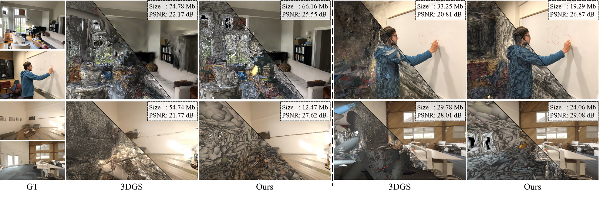
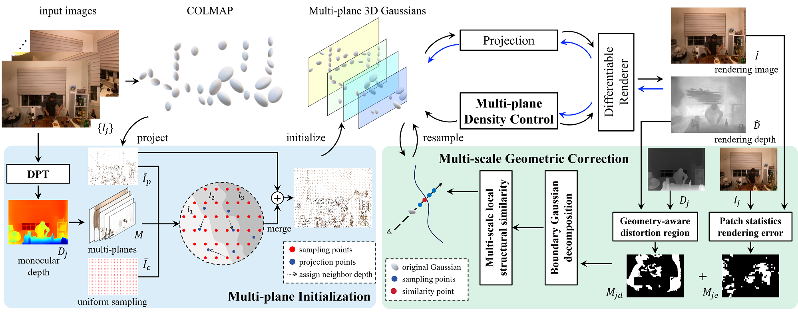

# MPGS: Multi-plane Gaussian Splatting for Compact Scenes Rendering


### [Paper Link](https://ieeexplore.ieee.org/document/10918847/)

***
Deqi Li<sup>1</sup>, Shi-Sheng Huang<sup>1</sup>, Hua Huang<sup>1✉</sup>

<sup>1</sup>School of Artificial Intelligence, Beijing Normal University; <sup>✉</sup>Corresponding Author.
***

   
   


## Environmental Setups
Please follow the [3D-GS](https://github.com/graphdeco-inria/gaussian-splatting) to install the relative packages.
```bash
git clone https://github.com/wanglids/MPGS
cd MPGS
conda create -n MPGS python=3.9
conda activate MPGS

pip install -r requirements.txt
pip install -e submodules/MPGS-gaussian
pip install -e submodules/simple-knn
```
Please follow the [Pytorch3d](https://github.com/facebookresearch/pytorch3d) to install package for reconstruct mesh.
In our environment, we use pytorch=1.12.1+cu116.
## Data Preparation
We conducted tests on three COLMAP-format datasets. For custom dataset you can organize your dataset as follows.

**For COLMAP:**  
```
|── dataset
|	|── LLFF
|		|── cecread
|			|── images
|				|── 0.png
|				|── 1.png
|				|── 2.png
|				|── ...
|			|── DPT_depth
|				|── 0.npy
|				|── 1.npy
|				|── 2.npy
|				|── ...
|			|── colmap
|				|── sparse
|				|── ...
|			|── output
|		|── ...
|	|── Space
|		|── ...
|	|── Dynamic
|		|── ...
```


## Training
For training LLFF scenes such as `cecread`, run 
``` 
python train.py --source_path rootpath/data/cecread --model_path output/MPGS --configs arguments/LLFF/cecread.py
``` 
You can customize your training parameters via configuration files. Among them, muti_mode is the initial depth mode, and you can choose between neighbor (neighborhood) or the default max (maximum value) mode to suit different scenes.
## Rendering
Run the following script to render the images.  

```
python render.py --source_path  rootpath/data/cecread --model_path output/MPGS --configs arguments/LLFF/cecread.py
```


In addition, you can also use Viewer as [3DGS](https://github.com/graphdeco-inria/gaussian-splatting) to view rendering images and Gaussian distribution.

## Scripts

There are some helpful scripts in `scripts/`, please feel free to use them.

---

## Citation
If you find this code useful for your research, welcome to cite the following paper:
```
@article{Li2025MPGS,
  author={Li, Deqi and Huang, Shi-Sheng and Huang, Hua},
  journal={IEEE Transactions on Visualization and Computer Graphics}, 
  title={MPGS: Multi-Plane Gaussian Splatting for Compact Scenes Rendering}, 
  year={2025},
  volume={31},
  number={5},
  pages={3256-3266}
  }
```
## Acknowledgments

Some source code of ours is borrowed from [3DGS](https://github.com/graphdeco-inria/gaussian-splatting),[SAGS](https://github.com/XuHu0529/SAGS). We sincerely appreciate the excellent works of these authors.